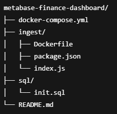

# 📊 Metabase Finance Dashboard

Projeto de **Business Intelligence (BI)** utilizando **Metabase**, com ingestão de dados financeiros reais via **API pública**, persistência em **PostgreSQL** e orquestração completa com **Docker**.

O objetivo é demonstrar uma **arquitetura real de dados**, separando claramente:
- ingestão
- armazenamento
- visualização

Tudo isso **sem frontend customizado**, usando apenas ferramentas de mercado.

---

## 🧱 Diagrama de Arquitetura


🚀 Stack Utilizada
## Ingestão / Backend

- Node.js 20
- Axios
- pg

## Banco de Dados
- PostgreSQL 15

## BI / Analytics
- Metabase

## Infraestrutura

- Docker
- Docker Compose

# Estrutura

metabase-finance-dashboard/


▶️ Como Rodar o Projeto

## Pré-requisitos

- Docker
- Docker Compose


▶️ Rodar a ingestão inicial

```
docker compose down
docker compose up --build ingest
```

▶️ Subir o Metabase

```
docker compose up -d
```

▶️ Acesse: [http://localhost:3000](http://localhost:3000)

